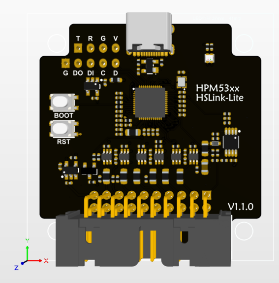

# bmp-hpm-port

本仓库是基于blackmagic的hpm平台移植，目前适配：

- hslinklite(hpm5301)
  - 

- hslinkpro(hpm5301)
  - 

## 工程说明

### 依赖说明

目前工程使用vscode进行开发，建议安装以下插件：

- `C/C++`
- `CMake`
- `CMake Tools`
- `HPM Pinmux Tool`

工程依赖hpm_sdk，建议使用`1.8`版本。
使用时需要将`hpm_sdk`路径及工具链添加到环境变量中,也可在工程settings.json中配置。

- `HPM_SDK_BASE`：hpm_sdk的安装路径
  - 示例：`D:/sdk_env_v1.8.0/hpm_sdk`
- `GNURISCV_TOOLCHAIN_PATH`：riscv toolchain的安装路径,无特殊需求，可使用sdk_env_v1.8.0/toolchains中的版本
  - 示例：`D:/sdk_env_v1.8.0/toolchains/rv32imac_zicsr_zifencei_multilib_b_ext-win`

## 效果展示

### SWD调试波形

使用hpm做移植的好处是可以通过fgpio和spi外设，使得swd/jtag时钟速度更快，从而提高调试效率。

- fgpio模式，目前SWD时钟最快可达`18M`


- spi模式适配中，适配后SWD最高`80M`

### 命令行调试演示

通过gdb强大的命令直驱BMP可以获得比ide更加灵活和高效的调试体验。


## bmp使用说明

- `xxx-gdb yyy.elf`：启动gdb并加载elf文件
- `target extended-remote //./COMx`：连接GDBServer，其中COMx为串口号
- `monitor jtag_scan`:通过jtag扫描设备
- `monitor swd_scan`：通过swd扫描设备
- `monitor auto_scan`：自动扫描
- `attach 1`：连接到设备号为1的设备
- `load`：加载elf文件到设备中

### 连接示例

```bash
(gdb) target extended-remote //./COM8
Remote debugging using //./COM8
(gdb) monitor help
(gdb) monitor jtag_scan
Target voltage: Unknown
Available Targets:
No. Att Driver
 1      STM32F40x M4
(gdb) attach 1
(gdb) load
Loading section .isr_vector, size 0x188 lma 0x8000000
Loading section .text, size 0x4898 lma 0x8000190
Loading section .rodata, size 0x60 lma 0x8004a28
Loading section .ARM, size 0x8 lma 0x8004a88
Loading section .init_array, size 0x4 lma 0x8004a90
Loading section .fini_array, size 0x4 lma 0x8004a94
Loading section .data, size 0x10 lma 0x8004a98
Start address 0x0800468c, load size 19104
Transfer rate: 32 KB/sec, 764 bytes/write.
(gdb)
```

### 其他常用gdb命令

- `monitor <cmd>` : 向远程目标发送特定监控命令（依赖server实现）
- `commands <index>`：自定义断点脚本
- `break *<address>`：在程序的指定地址处设置断点
- `print sizeof(xxxx)`: 计算变量大小
- `dprintf main.c:122,"hello\n"`: 动态打印
- `tbreak main` : 设置临时断点
- `set print pretty on`: 优化显示
- `run` 或 `r`：开始执行程序
- `continue` 或 `c`：继续执行程序
- `backtrace` 或 `bt`：查看当前调用堆栈
- `set var <var>=<value>`：修改变量的值
- `disassemble /s <address>`:  查看反汇编
- `info locals`：显示当前函数中的局部变量
- `info target`: 查看程序内存布局
- `info registers`: 查看寄存器
- `find /w 0x08000000,+0x1000,0xdeadbeef`: 遍历内存段查找特定值

### HPMicro-XPI调试支持

本项目基于HPM平台开发，优先支持了HPM平台的XPI-FLASH调试，下载算法来自官方openocd仓库。适用于hpm平台所有芯片，已在5300系列和6800系列验证OK，其他型号用户可自行验证。

用户attach到HPM芯片后，可通过`xpi_cfg`命令为rom_api传入配置参数，供下载算法使用。不执行`xpi_cfg`则使用默认参数，使用`xpi_info`可查看当前的配置参数。

命令格式如下：

```bash
xpi_cfg -- <flash_base> <flash_size> <xpi_base> [opt0] [opt1]
```

5300系列示例:

```bash
monitor xpi_cfg 0x80000000 0x2000000 0xf3000000 0x6 0x1000
```

其他系列参数可参考官方openocd的配置文件。

## Cortex-Debug配置

对于不习惯命令行操作gdb的用户，可以使用Cortex-Debug插件。Cortex-Debug对bmp提供了良好的支持。

swd配置文件参考:

```json
{
    "name": "bmp-launch-swd",
    "cwd": "${workspaceFolder}",
    "executable": "./build/LED_TEST_F407ZE.elf",
    "request": "launch",
    "type": "cortex-debug",
    "runToEntryPoint": "main",
    "servertype": "bmp",
    "device": "STM32F407ZE",
    "BMPGDBSerialPort": "//./COM8",
    "interface": "swd",
    "gdbPath": "C:/Develop_Software/gdb-multiarch-14.1/bin/gdb-multiarch.exe",
}
```

jtag配置文件参考:

```json
{
    "name": "bmp-launch-swd",
    "cwd": "${workspaceFolder}",
    "executable": "./build/LED_TEST_F407ZE.elf",
    "request": "launch",
    "type": "cortex-debug",
    "runToEntryPoint": "main",
    "servertype": "bmp",
    "device": "STM32F407ZE",
    "BMPGDBSerialPort": "//./COM8",
    "interface": "jtag",
    "gdbPath": "C:/Develop_Software/gdb-multiarch-14.1/bin/gdb-multiarch.exe",
}
```

### HPM平台Cortex-Debug配置示例

由于Cortex-Debug对于Launch动作默认会写ARM-CoreSight寄存器以执行软复位，HPM作为RISCV的标准实现自是无法兼容。好在Cortex-Debug预留了`overrideResetCommands`和`overrideLaunchCommands`关键字供用户自定义复位操作，因此，本文示例的配置文件，将Launch命令重写为配置Flash参数和load命令的组合，从而做到跟ARM调试一样的效果。

```json
{
    "name": "bmp-launch",
    "cwd": "${workspaceFolder}",
    "executable": "build/output/demo.elf",
    "request": "launch",
    "type": "cortex-debug",
    "runToEntryPoint": "main",
    "overrideResetCommands": [],
    "overrideLaunchCommands": [
        "monitor xpi_cfg 0x80000000 0x2000000 0xf3000000 0x6 0x1000",
        "load"
    ],
    "servertype": "bmp",
    "interface": "jtag",
    "BMPGDBSerialPort": "//./COM8",
    "gdbPath": "C:/Develop_Software/gdb-multiarch-14.1/bin/gdb-multiarch.exe",
    "svdFile":"${config:hpm_sdk_env}/hpm_sdk/soc/HPM5300/HPM5301/HPM5301_svd.xml",
}
```


## 参考项目和文档

- [先楫半导体hpm_sdk使用vscode进行开发](https://www.hpmicro.com/service-support/technical-articles/168)

- [CherryDAP官方仓库](https://github.com/cherry-embedded/CherryDAP)

- [MicroLink官方仓库](https://github.com/Aladdin-Wang/MicroLink)

- [Black Magic Debug官网](https://black-magic.org/index.html)

- [GDB官方文档](https://sourceware.org/gdb/documentation/)